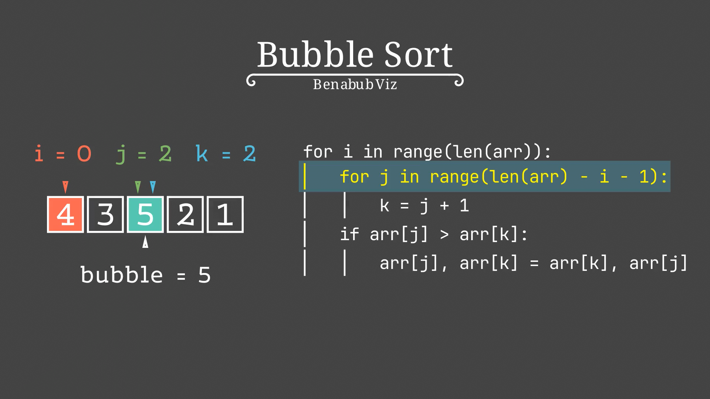
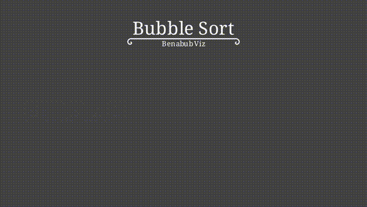

# algomanim

A Manim-based library for visualizing algorithms and explaining LeetCode-style solutions.

## Demo

### Screenshot



### GIF



## Installation

```sh
# pip
pip install algomanim

# poetry
poetry add algomanim
```

## Examples

You can find example render scripts and try rendering videos yourself in the repository's `examples/` folder.  
**Note:** The `examples/` folder is not included in PyPI or pip/poetry installations.  
See [`examples/README.md`](examples/README.md) for details.

## License

MIT
